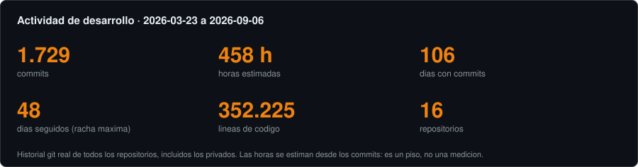
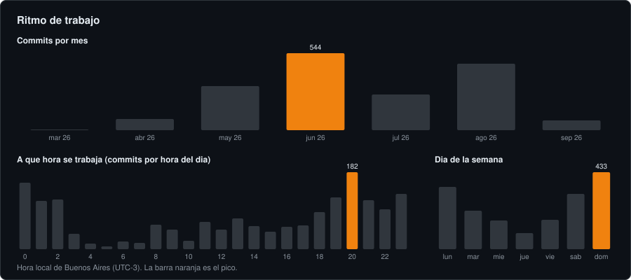
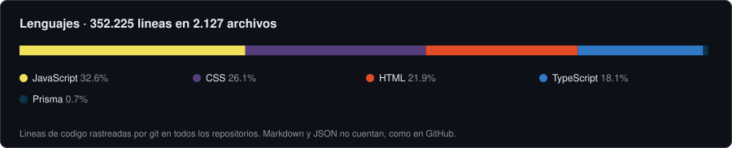

<div align="center">


<br/><br/>

[](https://www.vanisur.com)
[](mailto:vanisurdigital@gmail.com)
[](https://wa.me/5491178243027)

</div>

<br/>

## Quién soy

Fundé y dirijo **VANISUR**, una empresa de software de Buenos Aires que construye la infraestructura digital de negocios reales: comercios, gastronomía, concesionarias, inmobiliarias y aseguradoras.

Diseño el producto, escribo el código y lo pongo en producción. Hoy VANISUR tiene siete verticales funcionando, un panel central que controla las licencias de todos los clientes, y los primeros negocios en el aire.

## Qué es VANISUR

Un solo sistema, muchos negocios. Cada cliente recibe un sitio y un panel de gestión hechos para su rubro, y todos dependen de un cerebro central que emite y valida las licencias.

```
vanisur-admin (el cerebro)
│  clientes · membresías · licencias JWT · pagos · soporte
│
├── API pública de validación de licencias
├── SDK embebible que cargan todos los sitios
│
└── verticales (cada una con su sitio, su panel y su base aislada)
      comercio · kiosco · importados · gastronomía · concesionaria · inmobiliaria · seguros
```

| Vertical | Qué resuelve | Demo |
|---|---|---|
| Comercio | Catálogo, stock, pedidos por WhatsApp, panel de ventas | [tienda.demo.vanisur.com](https://tienda.demo.vanisur.com) |
| Gastronomía | Carta, pedidos, pantalla de cocina, caja | [gastro.demo.vanisur.com](https://gastro.demo.vanisur.com) |
| Concesionaria | Vidriera 0 km y usados, CRM de consultas | [concesionaria.demo.vanisur.com](https://concesionaria.demo.vanisur.com) |
| Inmobiliaria | Propiedades, consultas, seguimiento comercial | [inmobiliaria.demo.vanisur.com](https://inmobiliaria.demo.vanisur.com) |
| Seguros | Planes, cotizaciones, seguimiento de prospectos | [seguros.demo.vanisur.com](https://seguros.demo.vanisur.com) |
| Kiosco e importados | Variantes del motor de comercio | [kiosco](https://kiosco.demo.vanisur.com) · [importados](https://importados.demo.vanisur.com) |

**Decisiones de arquitectura que definen el producto**

- Un cerebro, muchos inquilinos: los clientes viven en una sola base de Supabase aislados por políticas de fila (RLS). El límite entre dos negocios es la política, no el código.
- Kill-switch de licencia: si una membresía se suspende en el cerebro, el sitio del cliente se bloquea solo. Ningún sitio funciona sin una licencia válida.
- Un motor compartido (`crm-core`) sincronizado a todas las verticales: un arreglo se hace una vez.
- Deploy manual y verificado, gate de tests de aislamiento antes de cada publicación, y post-mortems escritos cuando algo sale mal.

## Actividad

Los tres gráficos se generan desde el historial git real de todos mis repositorios, incluidos los privados, que es donde vive casi todo el código. No dependen de servicios de terceros.

<div align="center">







</div>

## Stack

Lo que efectivamente corre en producción, no una lista de deseos.


## Cómo trabajo

- Producción primero: cada cambio se verifica en el dominio real, no en el repo.
- Seguridad como parte del producto: auditorías periódicas, credenciales fuera del código, 2FA obligatorio en el panel, RLS probado con una suite antes de cada deploy.
- Todo documentado: runbooks de alta, registro de riesgos, decisiones de arquitectura y memoria institucional que sobrevive a cualquier cambio de herramienta.
- IA como multiplicador, con criterio: la uso para construir más rápido, y la verificación sigue siendo mía.

<br/>

<details>
<summary><b>English</b></summary>
<br/>

I'm the founder and CEO of **VANISUR**, a software company in Buenos Aires that builds the digital infrastructure of real businesses: retail, restaurants, car dealerships, real estate and insurance agencies.

One system, many businesses. Every client gets a site and a management panel built for their industry, and all of them depend on a central brain that issues and validates licenses. Seven verticals are live, tenants are isolated with row-level security on a single Postgres database, and a license kill-switch blocks any site whose membership is suspended.

The activity charts above are generated from the real git history of all my repositories, private ones included. Stack: Next.js, TypeScript, Node.js, PostgreSQL on Supabase, Prisma, Firebase, Vercel and Mercado Pago.

</details>

<br/>

<div align="center">
<sub>Buenos Aires, Argentina · <a href="https://www.vanisur.com">vanisur.com</a></sub>
</div>
